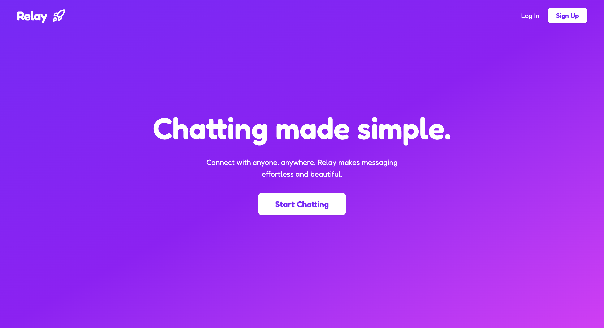
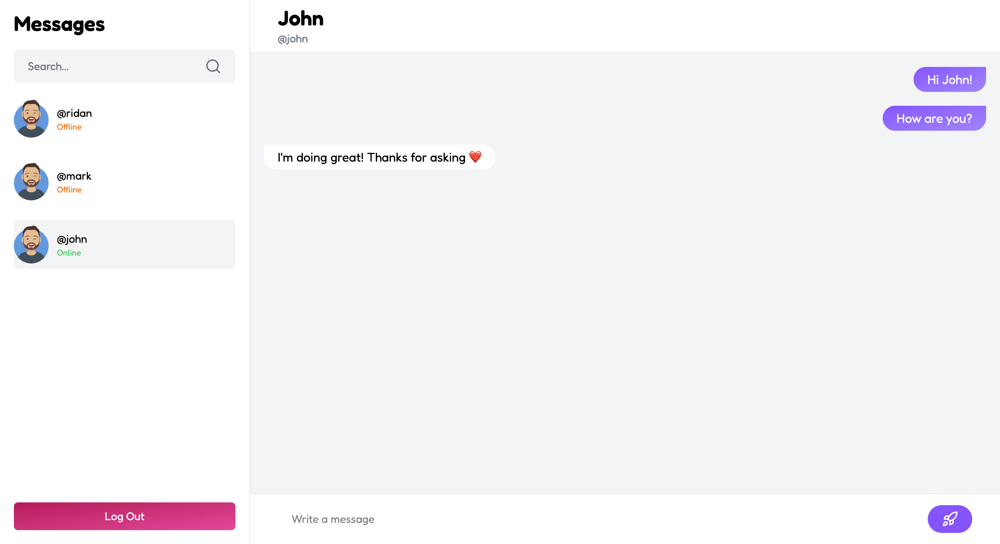
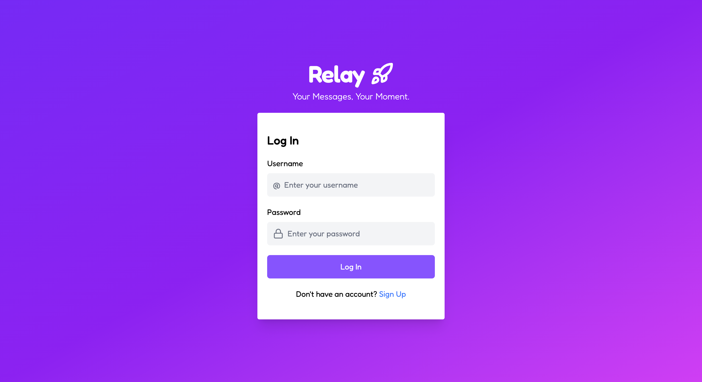

# Relay Chat

A real-time chat application with Socket.IO, JWT authentication, and multi-device support.



## Key Features

- **Real-time messaging** with Socket.IO
- **Multi-device login** - Use multiple devices simultaneously
- **Live user status** - See who's online
- **JWT authentication** with secure password hashing
- **Persistent chat history** stored in MongoDB

## Tech Stack

**Backend:** Node.js, Express, Socket.IO, MongoDB, JWT, bcrypt  
**Frontend:** React, Vite, Tailwind CSS, Axios

## Quick Start

### Prerequisites

- Node.js (v14+)
- MongoDB

### Backend Setup

```bash
cd backend
npm install
```

Create `.env` file:

```env
PORT=5050
MONGODB_CONN=your_mongodb_connection_string
JWT_SECRET=your_secret_key
```

Generate JWT secret:

```bash
node secret.js
```

Start server:

```bash
npm run dev
```

### Frontend Setup

```bash
cd frontend
npm install
```

Create `.env` file:

```env
VITE_API_URL=http://localhost:5050
```

Start app:

```bash
npm run dev
```

Visit `http://localhost:5173`

## Screenshots

### Chat Interface



### Login Screen



## Security

- bcrypt password hashing
- JWT token authentication (30-day expiry)
- Protected API routes
- Token validation on client and server

## Architecture Highlights

- **Socket.IO** for bidirectional real-time communication
- **RESTful API** for user and message management
- **MongoDB** for scalable data persistence
- **React Router** for seamless navigation
- **Axios interceptors** for automatic token injection

---

Built with ❤️ by Ridan Asif
